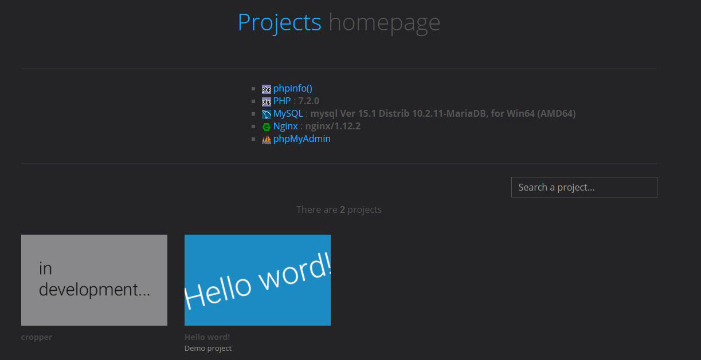

# Web projects homepage
> Web projects homepage for XAMMP and more...

<br>



Ce projet utilise :
* [Bootstrap](http://getbootstrap.com)
* [Modernizr](https://modernizr.com)
* [jQuery](http://jquery.com)
* [Screen](https://github.com/microweber/screen)

<br>

## Usage Instructions

1. `composer install`

2. Place the whole structure of files/folders in the directory : `htdocs` (In the main folder of your server).

3. Create/import your projects in the folder : `/projects`.

4. [OPTIONAL] Create a configuration file : `/projects/project1/.sources/config.ini`.
    - ```ini
      ;Project     :  The project name
      ;Created at  :  YYYY/MM/DD
      ;Author      :  Author name
      
      [infos_base]
      TITLE = 'The project name'
      
      DESCRIPTION = 'Project description...'
      
      URL_APP = 'http://dev.website.com'
      
      URL_DB = '/phpmyadmin/index.php?db=dbname'
      
      THUMBNAIL = 'http://dev.website.com/page2.php'
      ```

5. [OPTIONAL] To add a custom image to each project, you must create an image (400px x 250px) and place it in the folder `/projects/project1/.sources/` and name her `picture.jpg` at format **.jpg**.

<br>

## Version

- Homepage web projects 3.0.0
    - Renamed folder
    - Full doc in english
    - Used single quotes instead
    - Improve code
    - Add robots.txt file
    - ...

<br>
 
## License

[MIT License](LICENSE)
