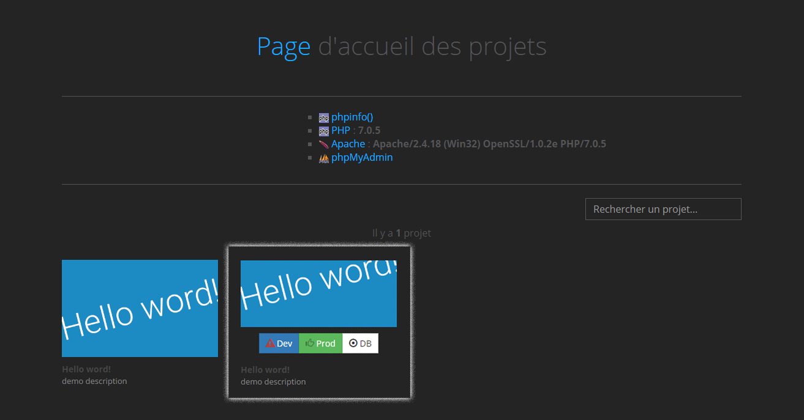

# Project-manager XAMPP / Web
Page d'accueil listant tout vos projets XAMPP / Web

Ce projet utilise :
* [Bootstrap](http://getbootstrap.com)
* [Modernizr](https://modernizr.com)
* [jQuery](http://jquery.com)
* [Screen](https://github.com/microweber/screen)

 

## Usage Instructions

1. `composer install`

2. Placer toute la structure des fichiers/dossiers dans le répertoire `htdocs` (Remplacez-les si nécessaire).

3. Créer/Importer vos projets dans le dossier `/www`.

4. Un fichier de configuration `/www/YOUR_PROJECT/.sources/config.ini` peut être construit pour chaque projet (FACULTATIF).

    ;Project     :  The project name
    ;Created at  :  YYYY/MM/DD
    ;Author      :  Author name
    
    [infos_base]
    title = "The project name"
    
    description = "Project description..."
    
    URLDEV = "http://dev.website.com"
    
    URLPROD = "http://website.com"
    
    URLDB = "http://localhost/phpmyadmin/index.php?db=dbname"
    
    thumbnail = "http://website.com/about"

5. Pour ajouter une image personnalisée à chaque projet, il faut créer une image (en 400px x 250px) et la placer dans le dossier `/www/YOUR_PROJECT/.sources/` et la nommer `picture.jpg` au format **.jpg** (FACULTATIF).

 

## Version

Project-manager XAMPP / Web 2.1
- New design
- New features
- Mobile compatibility / responsive
- Thumbnail website

 
 
## License

MIT License

Copyright (c) 2016 Breith Barbot | [Breithbarbot.name](https://breithbarbot.name)

Permission is hereby granted, free of charge, to any person obtaining a copy
of this software and associated documentation files (the "Software"), to deal
in the Software without restriction, including without limitation the rights
to use, copy, modify, merge, publish, distribute, sublicense, and/or sell
copies of the Software, and to permit persons to whom the Software is
furnished to do so, subject to the following conditions:

The above copyright notice and this permission notice shall be included in all
copies or substantial portions of the Software.

THE SOFTWARE IS PROVIDED "AS IS", WITHOUT WARRANTY OF ANY KIND, EXPRESS OR
IMPLIED, INCLUDING BUT NOT LIMITED TO THE WARRANTIES OF MERCHANTABILITY,
FITNESS FOR A PARTICULAR PURPOSE AND NONINFRINGEMENT. IN NO EVENT SHALL THE
AUTHORS OR COPYRIGHT HOLDERS BE LIABLE FOR ANY CLAIM, DAMAGES OR OTHER
LIABILITY, WHETHER IN AN ACTION OF CONTRACT, TORT OR OTHERWISE, ARISING FROM,
OUT OF OR IN CONNECTION WITH THE SOFTWARE OR THE USE OR OTHER DEALINGS IN THE
SOFTWARE.